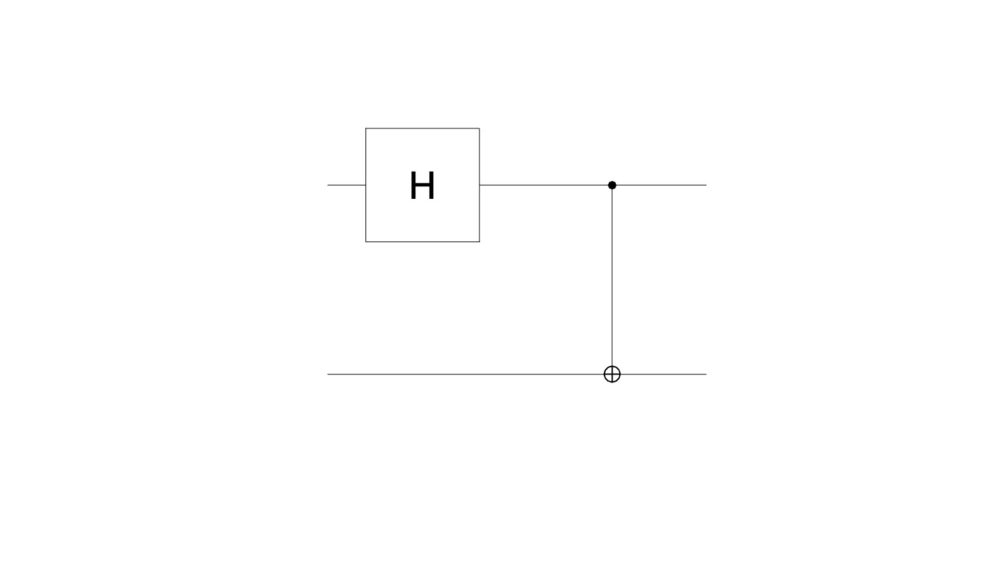
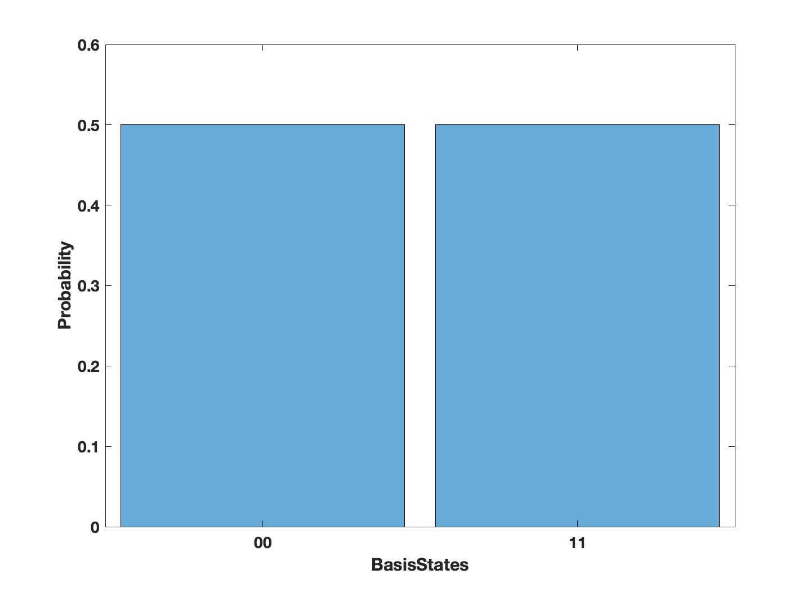

# MATLAB and Qiskit Runtime Primitives (Sampler and Estimator)

The Qiskit Runtime service bridges the gap between several programming languages and quantum computing frameworks by being language-agnostic. It can accept OpenQASM 3.0 strings when submitting jobs to the quantum backend via REST API calls. As long as a programming language supports making REST API calls, which most languages do, and the associated quantum framework supports the generation of OpenQASM 3.0 strings from quantum circuits, quantum jobs can be successfully submitted to IBM Quantum backends and results can be retrieved in a language-agnostic manner.
## OpenQASM 3.0
OpenQASM is an imperative programming language designed for near-term quantum computing algorithms and applications. Quantum programs are described using the measurement-based quantum circuit model with support for classical feedforward flow control based on measurement outcomes. It forms a bridge between several quantum programming languages giving us a universal set of instructions that can run on quantum near-term hardware.

In order to create a circuit and generate the corresponding QASM string, [MATLAB Quantum computing toolbox](https://www.mathworks.com/products/quantum-computing.html) was used. This toolbox lets the user to build, simulate, and run quantum algorithms. With MATLAB Quantum Support Package, the user can:
- Build circuits to implement quantum algorithms using a variety of built-in and customizable composite gates
- Verify implementation of algorithms using simulations in your local computer or connect to a remote simulator through cloud services
- Execute Variational Quantum Algorithms (VQAs) with the help of variational quantum circuits.
## Quick start
1. Install MATLAB 2023a. [Link](https://www.mathworks.com/help/install/)
2. Install Quantum Computing Toolbox. [Link](https://www.mathworks.com/products/quantum-computing.html)
3. Clone this repo into your local machine. [How to clone a repository from MATLAB?](https://www.mathworks.com/help/simulink/ug/clone-git-repository.html)
4. Run ```startup.m``` to ensure that all files in the repository are added to the MATLAB path.
5. Input your IBM Quantum API token into the Examples/tests. i.e. ```apiToken= 'put your IBM quantum API token'```
6. Run the Examples/tests!

## Test the defined classes

To run all tests and evaluate all the classes for sampler and estimator, from MATLAB execute the following command.

```
For IBM Quantum Platform:
result = Test_Sampler_Estimator ('ibm_quantum','MY_IBM_QUANTUM_TOKEN', [])


For IBM Quantum Cloud:
result = Test_Sampler_Estimator ('ibm_cloud','MY_IBM_CLOUD_API_KEY','MY_IBM_CLOUD_CRN' )

```
output:
```
 1×6 TestResult array with properties:

    Name
    Passed
    Failed
    Incomplete
    Duration
    Details

Totals:
   6 Passed, 0 Failed, 0 Incomplete.
   26.9564 seconds testing time.

```
If you want to test the classes separately follow [this](/test/README.MD)!

##  Creating Your First Quantum Program in MATLAB and submit it to IBM Quantum simulator

```
% Setup IBM Quantum credentials
token = 'Input your IBM Quantum API token';
%% Submit the token through the REST API to get the runtime primitive Access Token
resp = LoginAPI(token);
```

After submitting your Token through the REST API, the received response will include an id that can be used to communicate with the runtime primitives.

```
%% 
hubinfo = {};
hubinfo.hub = "ibm-q";
hubinfo.group = "open";
hubinfo.project = "main";
hubinfo.program_id = "sampler";
hubinfo.Access_API = resp.id;
hubinfo.backend = "ibmq_qasm_simulator";
hubinfo.session_id = [];
%%
```

In this part we specify the required information that is needed to be set before communicating to the IBM Quantum systems/simulators. 

```
circuit = quantumCircuit([hGate(1) cxGate(1,2)]);
plot (circuit);
```
By plotting the circuit, the generated circuit using quantum computing toolbox will be presneted with the defined gates, i.e.,

<p align="center">
  
</p>

Now in roder to simulate the circuit using the MATLAB state vector simualtor, the follwing line should be executed through the command qindow:
```
Results = simulate (circuit);
```
The output would be the follwing:
```
Results.BasisStates=
00
01
10
11

Results.Amplitudes=
0.707106781186548
0
0
0.707106781186548

Results.NumQubits = 2
```
```
histogram(Results)
```

<p align="center">
  
</p>

This simple example makes an entangled state, also called a [Bell state](https://en.wikipedia.org/wiki/Bell_state).


Once you've made your first quantum circuit using MATLAB Quantum computing toolbox and simulate it using the internal state vector simulator, you can then set the options information (such as error mitigation methods,number of shots, observables, etc.) for the sampler and estimator primitives. The follwoing line shows how to call options and set the required information. The third argument would be an structure including the Pauli strings and the corresponding coefficients. For more information you can check the `MaxcutEstimator.m`. After calling the SetOption function, a Qasm string will be generated that will be used to submit the job.

```
params = Options.SetOptions(circuit,hubinfo, problem);
%Run the Sampler primitive and submit the job through REST API
job = Sampler.run(params,hubinfo);
```

After submitting the job through the selected backend, the results can be retreived using the following:

```
Results = Job.retrieveResults(job.id,hubinfo.Access_API);
```

## License
[Apache License 2.0](https://github.ibm.com/Hamed-Mohammadbagherpoor/MATLAB-Runtime-Primitives/blob/main/LICENSE.txt)

